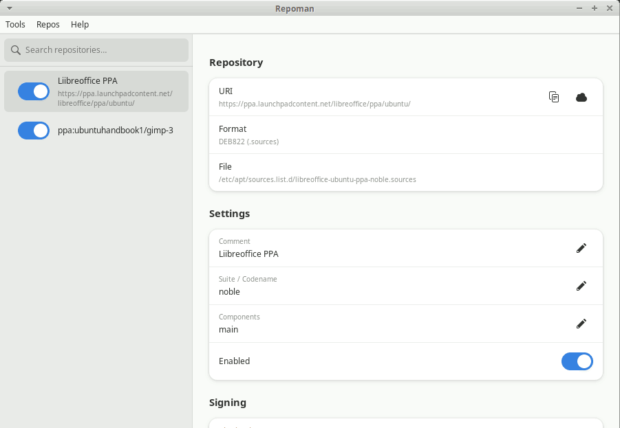
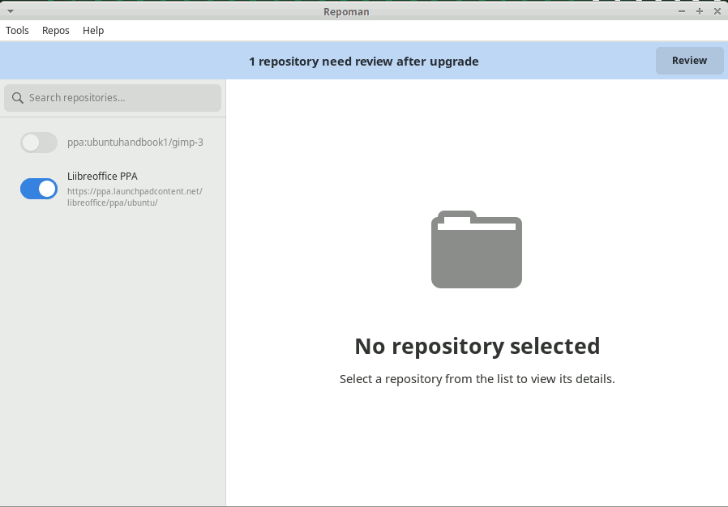

# Getting Started

## First launch

Open repoman from your system menu (System → Repo Man) or run `repoman` in a terminal.

The main window has two panels:

- **Left** — the repository list. Every third-party APT repository in `/etc/apt/sources.list.d/` appears here, sorted alphabetically. Ubuntu's own repositories are hidden.
- **Right** — the detail pane. Click any repository to see and edit its settings.

## The upgrade banner

If repoman finds repositories that need attention, a yellow banner appears at the top of the window. Repositories flag as needing attention in two cases:

1. **Disabled** — Ubuntu set `Enabled: no` during an upgrade.
2. **Stale codename** — the repository is enabled, but its suite field (`focal`, `jammy`, `noble`, …) doesn't match your current Ubuntu release. These generate silent 404 errors on every `apt update`.

The banner shows how many repositories need attention. Click **Review** to open the upgrade wizard, or dismiss it and deal with them manually via the detail pane.

You can also open the upgrade wizard at any time via **Tools → Run Upgrade Assistant…**, whether the banner is visible or not.

## Status icons

Each repository row in the sidebar shows a small icon on the right:

| Icon | Meaning |
|------|---------|
| ✓ (green) | Available for the target release |
| ⚠ (orange) | Not yet available for the target release |
| 🔒 (grey) | Suite-agnostic — `stable`, `main`, etc. — no codename check needed |
| ? (dimmed) | Not yet checked |

The `?` icon is the default before any availability check runs. The wizard runs checks on Step 2; the compat checker runs them independently.

## What repoman does not touch

- Ubuntu's own repositories (`archive.ubuntu.com`, `security.ubuntu.com`, `ports.ubuntu.com`, `esm.ubuntu.com`)
- Any repository in `/etc/apt/sources.list` (the legacy root file) — only files in `sources.list.d/` are managed
- Package installation, removal, or updates — repoman only manages repository configuration

## Keyboard shortcuts

| Shortcut | Action |
|----------|--------|
| `Ctrl+U` | Run Upgrade Assistant |
| `Ctrl+R` | Open Software Updater |
| `F5` | Refresh repository list |
| `Ctrl+N` | Add Repository |
| `Ctrl+S` | Save state |
| `Ctrl+F` | Search repositories |
| `Ctrl+F1` | Keyboard shortcuts window |
| `Ctrl+Q` | Exit |

The full list is also available in the app under **Help → Keyboard Shortcuts**.

## Next steps

- [Upgrade workflow](usage/upgrade-workflow.md) — walk through the wizard after an Ubuntu upgrade
- [Managing repositories](usage/managing-repos.md) — add, remove, edit, and annotate repos
- [State management](usage/state-management.md) — save your repo config and restore it on a new machine or after a reinstall
