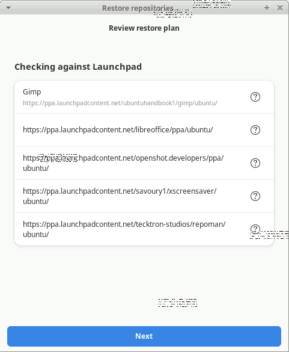
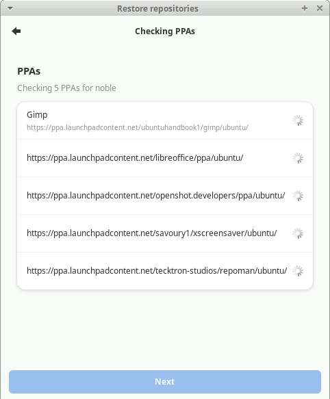
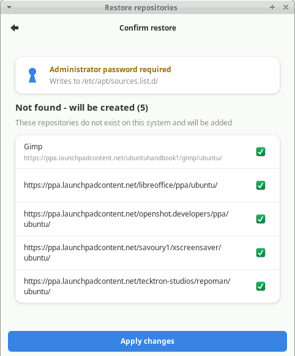

# State Management

repoman can save a snapshot of all your third-party repositories to a `.repoman` file
and restore it later — on the same machine, after a reinstall, or on a completely
different machine running a different Ubuntu release.

## Saving state

Open **Repos → Save state…**

repoman writes a `.repoman` file containing every third-party repository's URI,
suite, components, enabled state, signing key path, and (if the key file is readable)
the key bytes embedded as base64. The file is self-contained — no sidecars or archives.

The default filename is `state-YYYY-MM-DD.repoman`. You can save anywhere, including a
USB drive or a shared folder.

## Loading state

Open **Repos → Load state…** and select a `.repoman` file.

repoman compares the saved entries against the repositories currently on the system,
matching by primary URI.

### Same-machine restore (fast path)

If the saved file came from the current machine (or any machine running the same Ubuntu
release), repoman applies the enabled/disabled states of matched repositories in a
single polkit operation. No network checks are performed.

If any repositories from the file are not found on the system, the
[missing repositories dialog](#missing-repositories-dialog) appears.

### Cross-machine restore

When the file was saved on a machine running a **different Ubuntu release**, repoman
detects the mismatch and opens a **3-page restore wizard**:

| Repository type | Action |
|-----------------|--------|
| Suite-agnostic (e.g. `stable`, `main`, `focal-security`) | Restored unchanged — these work on any release |
| PPA | Availability checked against the current codename via Launchpad |
| Third-party with older or same-era codename | Suite updated to the current codename |
| Third-party with newer codename than current | Added as disabled — can't use a future-release repo on an older OS |

**Page 1 — Review restore plan**

All repositories are listed, grouped by what will happen to them:

- **Updating suite to `{codename}`** — non-PPA repos whose suite will be updated
- **Checking against Launchpad** — PPAs that need a live availability check
- **Adding as disabled** — repos not usable on the current release
- **Restoring unchanged** — suite-agnostic repos



Click **Next** to proceed.

**Page 2 — Checking PPAs** *(only shown when PPAs are present)*

Each PPA is checked against Launchpad for the current codename. A spinner appears per
row and is replaced by an icon as each result arrives. The Next button unlocks once all
checks are complete.



**Page 3 — Confirm restore**

A final grouped summary shows all changes. An administrator password prompt is shown
if anything will be written. Click **Apply changes** to proceed or close the wizard to
cancel with no changes written.



One polkit prompt covers all matched-repo changes. After applying, any repositories
not found on the system proceed to the missing repositories dialog.

## Missing repositories dialog

When saved repositories are not found on the current system (by URI), repoman offers
three choices:

- **Skip** — ignore the missing repositories entirely
- **Add N enabled** — create only the repos that were enabled when saved
- **Add all N** — create all missing repositories (disabled ones added as disabled)

If the `.repoman` file was saved with GPG key content embedded, the keys are written
to their original paths automatically as part of the same polkit operation — no manual
key installation needed. Only repos saved without embedded key content will show a
"you may need to install these keys manually" warning.

## File format

`.repoman` files are plain JSON (version 2):

```json
{
  "version": 2,
  "saved_at": "2026-07-08T14:22:00",
  "saved_codename": "noble",
  "repos": [
    {
      "types": ["deb"],
      "uris": ["https://packages.example.com/ubuntu"],
      "suites": ["noble"],
      "components": ["main"],
      "enabled": true,
      "description": "Example Project",
      "signed_by": "/usr/share/keyrings/example.gpg",
      "signed_by_content_b64": "<base64-encoded key bytes>",
      "architectures": [],
      "source_file": "/etc/apt/sources.list.d/example.sources"
    }
  ]
}
```

Version 1 files (no `saved_codename`, no `signed_by_content_b64`) are still loaded —
they use the same-machine fast path and show the manual key warning for any repo with
a `signed_by` path.
