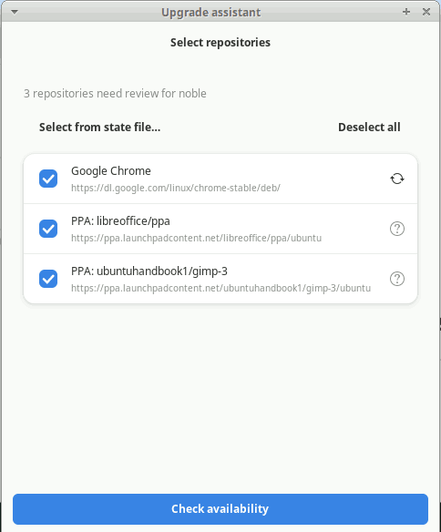
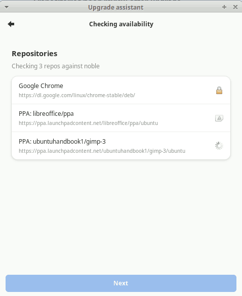
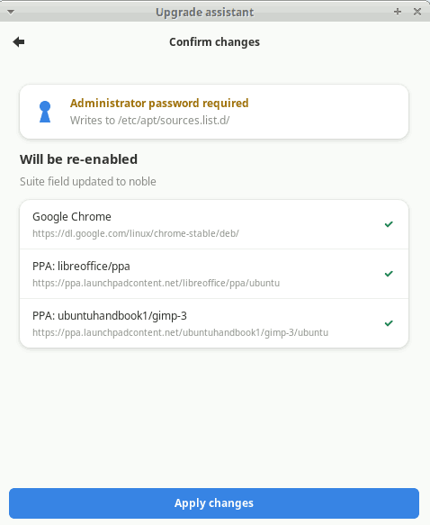

# Upgrade Workflow

The upgrade workflow is repoman's primary feature: a guided wizard that reviews your repositories after an Ubuntu version upgrade and re-enables the ones that are available for the new release.

## When to run it

Run the wizard after upgrading Ubuntu — for example, from 24.04 to 24.10, or from 24.04 LTS to 26.04 LTS. The upgrade banner at the top of the main window appears automatically if repoman detects disabled or stale repositories.

You can also run it any time from **Tools → Run Upgrade Assistant**.

## Step 1 — Select repositories

The first page lists every repository that repoman thinks needs attention. By default, all of them are checked.

- **Deselect all / Select all** — the button in the group header toggles everything at once. If at least one repository is unchecked, it reads "Select all".
- Unchecking a repository removes it from the availability check and leaves it unchanged on disk.
- Status icons on this page are based on parse-time information only — no network requests run here. Suite-agnostic repositories (those with a fixed suite like `stable` or `main`) show the ⟳ icon immediately.

Click **Check availability** when you're satisfied with the selection.

## Step 2 — Check availability

repoman checks each selected repository against its source to see whether packages exist for your current Ubuntu release.

For PPAs (`ppa.launchpadcontent.net`), it performs a HEAD request to the InRelease URL for the target codename. For other repositories, it does the same against the repository's distribution index.

Results:

| Icon | Status | Meaning |
|------|--------|---------|
| ✓ | Available | Packages exist for this release |
| ⚠ | Unavailable | No packages found for this release — will be skipped |
| 🔒 | Suite-agnostic | Fixed suite name, no codename check needed |

Hover over any icon to see a tooltip with the full status description.

Once all checks resolve, the **Next** button activates. If you navigate back to Step 1 and return, the check results are preserved — the check does not run again.

!!! note
    Network checks can take several seconds per repository. If a check times out or fails with a network error, the repository is marked unavailable and skipped.

## Step 3 — Confirm changes

The confirmation page shows exactly what will happen:

- **Will be re-enabled** — repositories that are available for the new release. For repositories with a codename suite (e.g. `jammy`), the suite will be updated to the current release name. For suite-agnostic repositories (e.g. `stable`), the suite is left unchanged — only `Enabled: yes` is written.
- **Skipped — not yet available** — repositories that returned unavailable. No changes are made to these files.

If there are no repositories to re-enable (everything is either already current or suite-agnostic), the auth row and the repository groups are hidden, and the button reads **Done**. Clicking Done closes the wizard without making any changes and without a polkit prompt.

## Applying changes

Click **Apply changes**. A polkit authentication dialog asks for your administrator password. After authenticating:

- Each affected `.sources` file is updated atomically (written to a `.tmp` file then renamed).
- The main window sidebar and banner refresh.
- The banner disappears if no repositories still need attention.

If you cancel the polkit dialog, a toast appears and the wizard stays open so you can try again.

## Pre-upgrade compatibility check

Before upgrading Ubuntu, you can check which of your PPAs support the target release using **Tools → Check pre-update compatibility…**

Select a target release from the dropdown and click **Check compatibility**. Results use the same status icons as the wizard. Clicking any status icon opens a detail popover with:

- The repository's current suite and the target codename
- For PPAs: a link to the Launchpad page
- For unavailable PPAs: which Ubuntu release has the most recent packages — useful for deciding whether a PPA is still maintained
